The Pacer console is a Svelte SPA served by the same Go binary that runs the orchestrator. Two top-level groups in the sidebar:

- **Control** — read-only observation. `Overview`, `Jobs`, `Stats`, `Audit`.
- **Config** — state-changing edits. `Projects`, `Repos`, `Pools`, `Backup`.

Screenshots below were captured against a development database with synthetic data (3 projects, 5 pools, 4 repos, ~80 jobs spanning every status). Real deployments will look the same — just with your data.

## Sign in

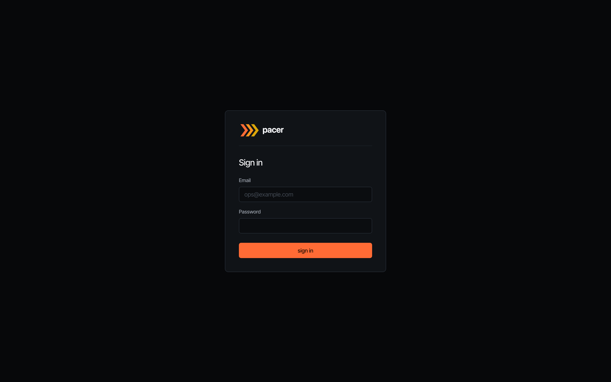

The login screen is the first thing operators see when `auth.disabled: false`. Local sign-in uses the bootstrap email + the random password Pacer logs once to stderr on first start. If `auth.oidc.enabled: true`, an additional **Sign in with SSO** button appears above the divider.

The page disappears entirely when `auth.disabled: true` — the layout detects the flag and routes everything to the dashboard. Useful for private-network deployments behind a reverse proxy that already authenticates.

## Overview

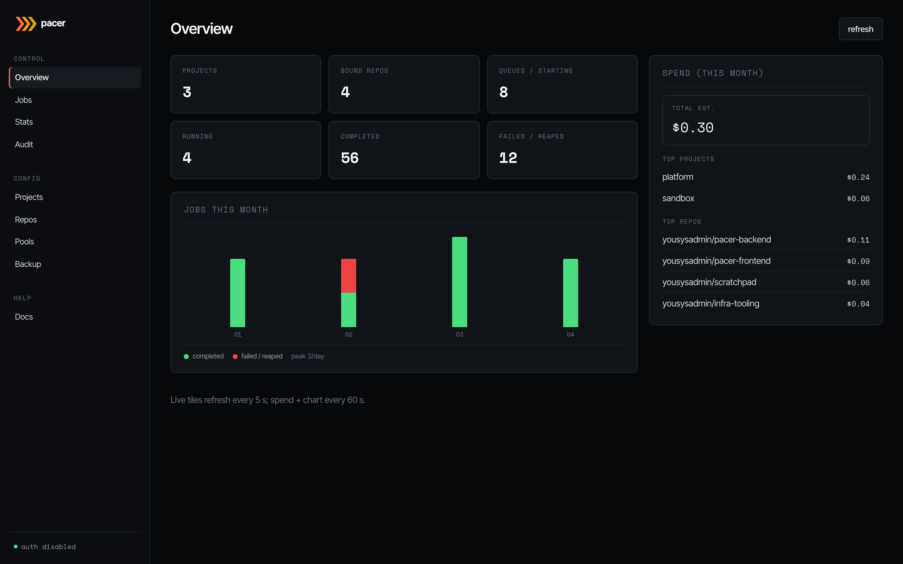

The dashboard. Live tiles on the left refresh every 5 s and summarise the current pool state: how many projects you've configured, repos bound, jobs queued or starting, jobs running, and how many ended in `completed` vs `failed/reaped` over the visible window.

The bar chart underneath plots **completed** (green) and **failed/reaped** (red) jobs day-by-day for the current month. The right-hand spend card refreshes every 60 s and ranks the top projects and repos by estimated spend (launch-time on-demand price × elapsed run time). Sub-cent runs are formatted with four decimals so they don't round to `$0.00`.

## Jobs

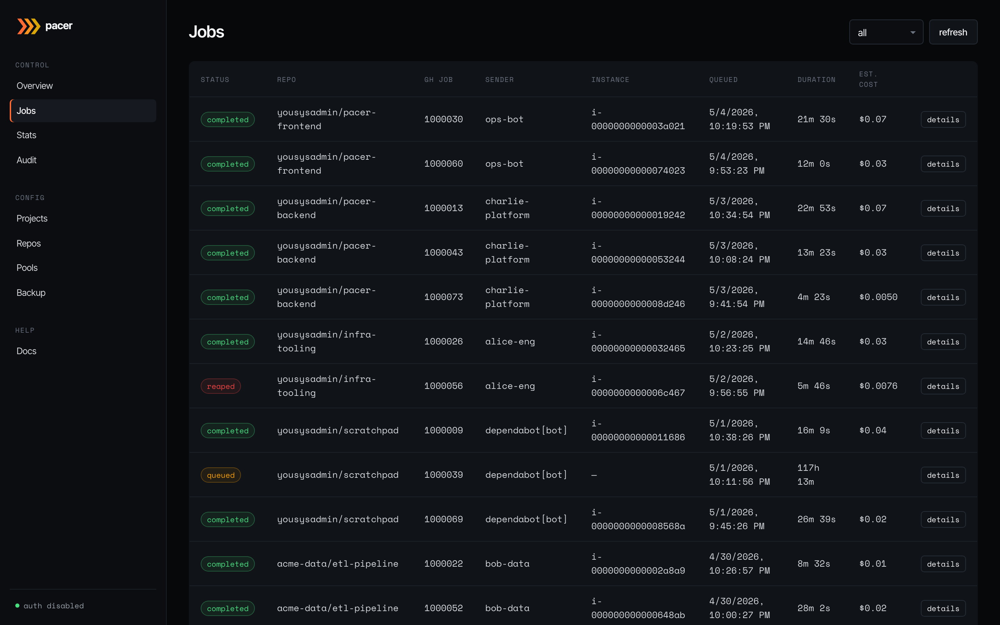

Every webhook Pacer has accepted, newest first. Status is colour-coded: `queued` (amber), `claimed`/`starting`/`running` (blue/info), `completed` (green), `failed`/`reaped` (red). Columns show the bound repo, GitHub job ID, sender (the GitHub user or bot that triggered the workflow), the EC2 instance ID Pacer placed the job on, the queue/launch timestamps, run duration, and the estimated cost.

The **all** dropdown filters by status. The `details` button on each row opens the full timeline modal:

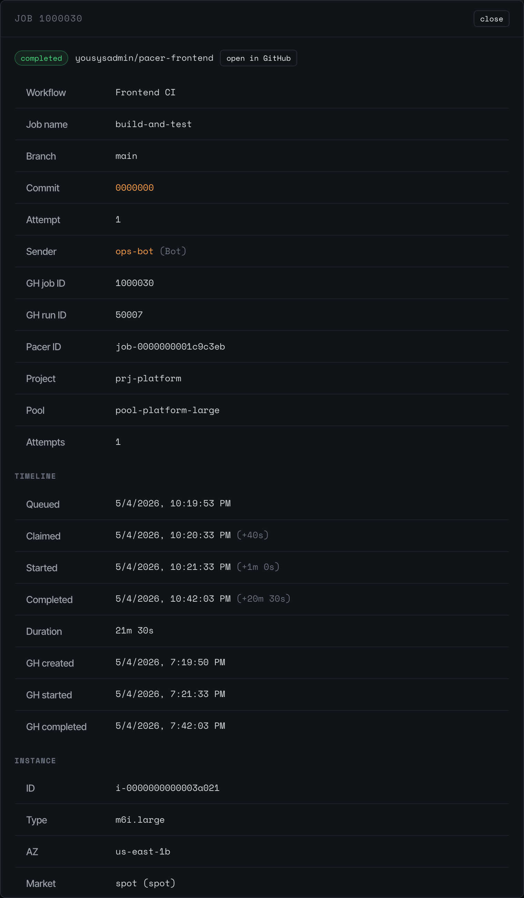

The detail modal shows everything Pacer knows about a single job: workflow + branch + commit, the GitHub job/run IDs, the project and pool that picked it up, the number of attempts, and a timeline of state transitions (`queued -> claimed -> running -> completed`). Click **open in GitHub** to jump to the run on github.com.

## Stats

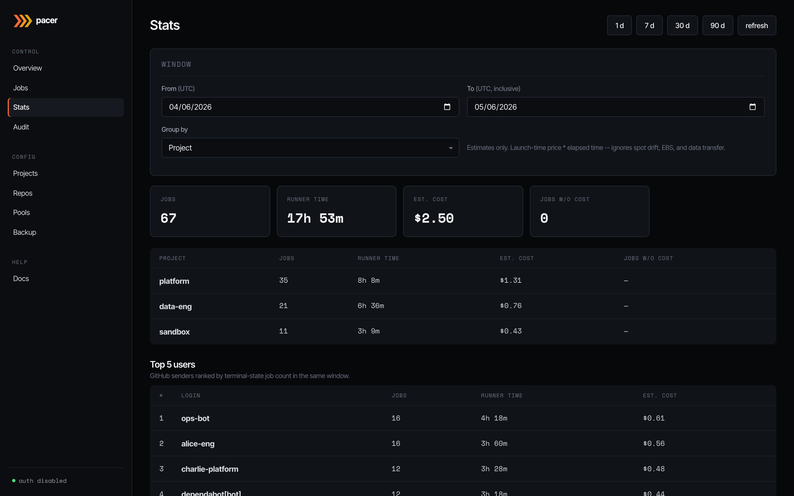

Roll-ups over a configurable window (1 d / 7 d / 30 d / 90 d, or a custom range). Group by **project**, **pool**, **repo**, or **runner label**. Tiles up top show jobs run, total runner time, estimated cost, and how many jobs lacked a price quote at spawn time (those contribute zero to the cost total — the headline is a floor, not a final answer).

The lower table breaks the window down by your chosen group; below that, **Top 5 users** ranks GitHub senders by terminal-state job count in the same window. Useful for capacity planning and chargeback conversations.

## Audit

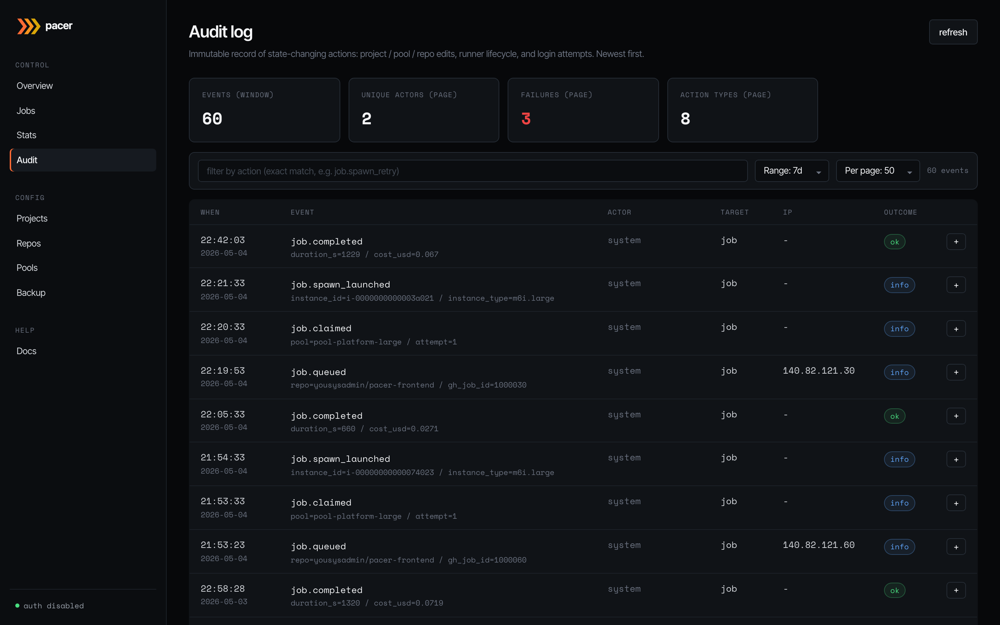

Immutable record of state-changing actions: project / pool / repo edits, runner lifecycle transitions (`job.queued`, `job.claimed`, `job.spawn_launched`, `job.completed`, ...), and login attempts. Newest first.

Filter by exact action name in the top input, or by a time range / page size on the right. The **info** badge on each row opens a side panel with the full event payload — useful when the headline cell can't fit the entire context (instance type, attempt count, error reason). Failures within the visible page are counted in the stat tile up top.

## Projects

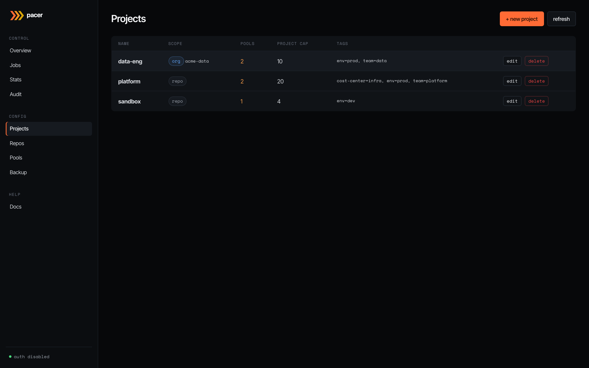

Projects are logical groupings: a name, a project-wide concurrency ceiling, cascading tags, and a disabled flag. Nothing EC2-shaped lives here — that's pools' job. The **scope** column shows how repos bind to the project: `repo` means individual repo bindings (the default); `org` means every repo under a GitHub org auto-binds.

The **+ new project** button opens the editor:

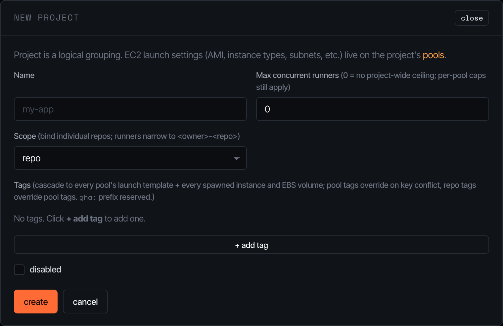

The cap field is a soft ceiling that gates the orchestrator's claim loop — set it to `0` to disable and let per-pool caps do all the work. Tags written here cascade down to every pool's launch template and onto every spawned instance / EBS volume; pool tags can override on key conflict, repo tags can override pool tags. The `gha:` prefix is reserved for Pacer-managed tags.

## Repos

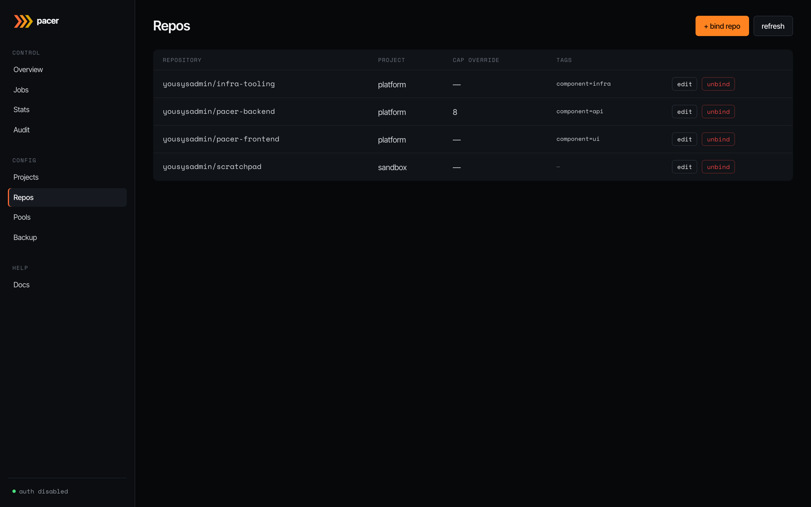

The bridge between GitHub and a project. Each row binds a `<owner>/<repo>` to one project, optionally overriding the project's concurrency cap, and stamping repo-specific tags onto instances at spawn time (these don't go on the launch template — pools are shared across repos).

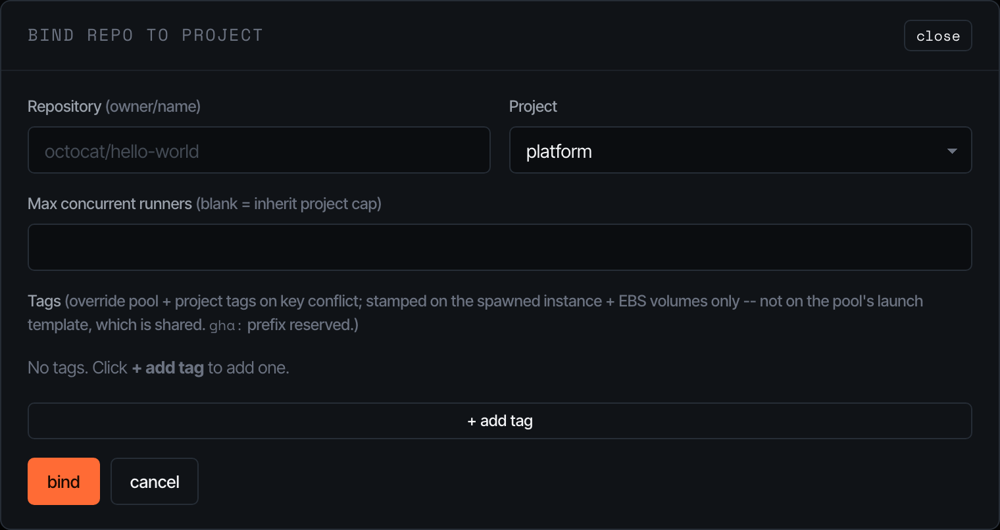

The bind modal is intentionally minimal — pick the project, paste the GitHub `owner/repo`, and (optionally) cap and tags. Pacer enforces 1:1 between a repo and a project.

## Pools

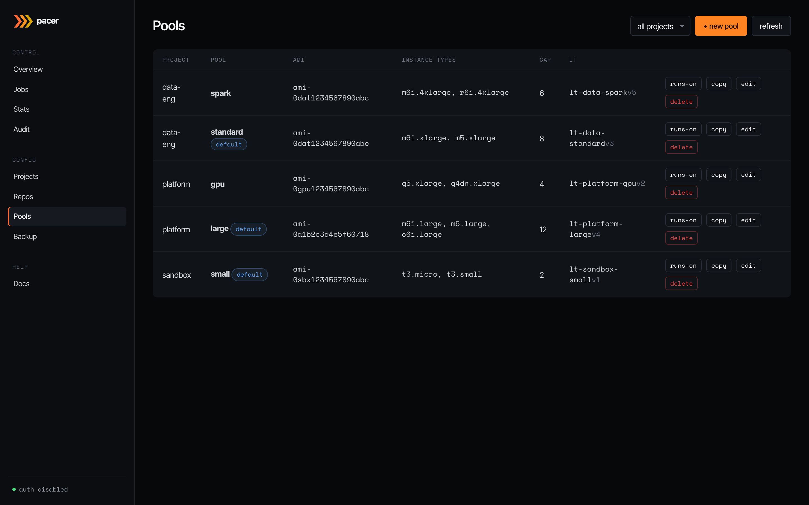

The EC2 launch-template shape. Each row is one materialised launch template: AMI, instance type list, per-pool concurrency cap, the LT ID + version Pacer assigned, and per-row buttons for **runs-on** (preview the runner labels GitHub workflows must use to land on this pool), **copy** (clone into a new pool), **edit**, and **delete**. The **default** badge marks the pool that catches workflows that don't specify a pool by name.

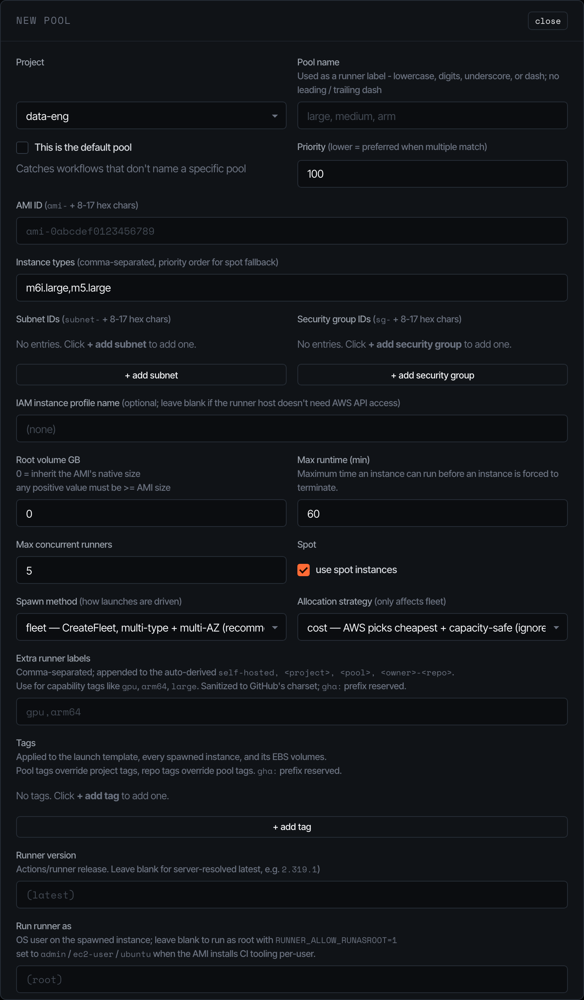

The pool editor is where most operator complexity lives:

- **AMI / subnets / security groups / IAM profile** — the EC2 surface; validated against the AWS account before the LT is created.
- **Instance types** — comma-separated, ordered. With **allocation strategy = priority**, this list is honoured (lowest index = highest priority). With **cost** (the default), AWS picks the cheapest match and ignores the order.
- **Spawn method** — `fleet` uses `CreateFleet` over every (instance_type x subnet) combo (AWS picks). `run_instances` is a serial fallback that only uses the first subnet.
- **Spot** — toggles spot pricing. Capacity-aware retry (30s/60s/120s/240s/300s) handles `InsufficientInstanceCapacity` and friends transparently.
- **Max runtime** — instances exceeding this are terminated by the reaper (default 60 minutes). EBS volumes go with them — `InstanceInitiatedShutdownBehavior=terminate` is set on the LT.
- **Extra runner labels** — appended to the auto-derived `[self-hosted, <project>, <pool>, <owner>-<repo>]` set. Sanitised to GitHub's character class.

Saving a pool re-materialises the LT (creates a new version + sets it default). The LT ID is stable across pool renames.

## Backup

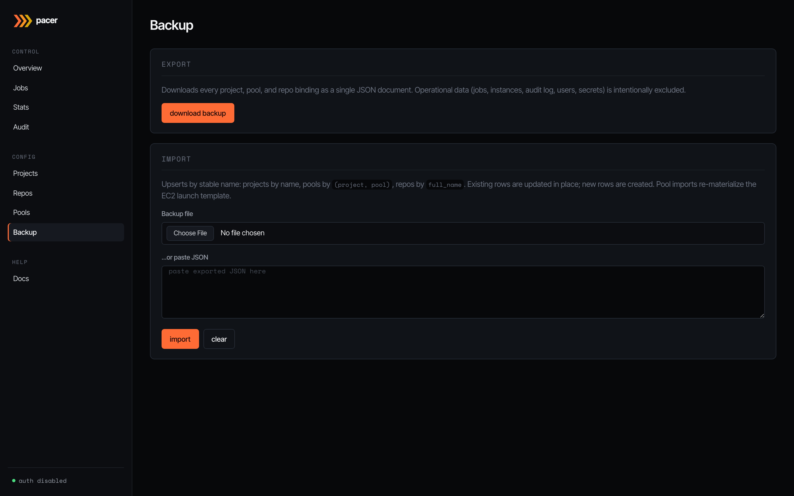

JSON export / import for the operator-edited slice of state: every project, pool, and repo binding. Operational data (jobs, instances, audit log, users, secrets) is intentionally excluded — backups are for moving config between environments, not for disaster recovery of the orchestrator's running state.

Imports upsert by stable name: projects by `name`, pools by `(project, pool)`, repos by `full_name`. Existing rows are updated in place; new rows are created. Pool imports re-materialise the EC2 launch template, so an import of pool config against a fresh AWS account works end-to-end (assuming the AMI / subnets / security groups exist).
